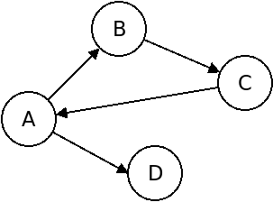
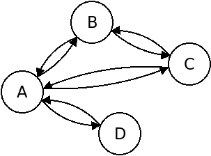
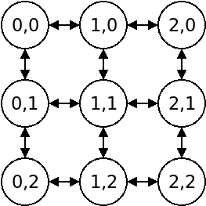

# How graphs are represented

In mathematics, a *graph* is a network consisting of *nodes* connected by *edges*. Each *edge* connects exactly two nodes. Furthermore, a graph can be either directed or undirected (more on that later)



There are many ways to represent a graph in computer memory. Helixgraph puts few restrictions on how you store your graph. This makes helixgraph combine well with other libraries for tilemaps, graphs, or any custom data structure that you already use.

Most algorithms can work with a graph that is specified using only two declarations: 1. a *getNeighbors* function, and 2. one or more *source nodes*. 

*getNeighbors* should be a function that, given a node, returns an iterable of [ edge, node ] pairs that represent neighboring edges and their nodes.

## Representing nodes

A node can be any kind of object or value, such as for example: strings, numbers, or objects, or even a mix of different object types. Helixgraph algorithms don't modify nodes, and don't expect the nodes to have a particular format.

Helixgraph relies on *Strict Equality Comparison* (i.e. `===`) to determine if two nodes are the same.

For example:
```js
const n1 = { id: 42 }
const n2 = n1;
// n2 and n1 are the same node, they refer to the same object.

const n3 = { id: 42 }
// n3 and n1 are different nodes. 
// They are different objects, even though they contain the same data.
```

## Representing edges

As with nodes, edges are never modified by helixgraph directly, and don't have to meet a particular structure. They can also be strings, numbers, or objects. 

For most helixgraph algorithms, there is a further freedom: the edges do not need to be unique. That means you can actually use *directions* to represent edges. For example, if you travel NORTH from node 'A' to node 'B', then you could use NORTH as the "edge", even though there are other nodes that have the same relation. 

## Representing a simple graph

Let's start with a simple representation, where each node is represented by a letter such as `'A'` or `'B'`, and each edge is represented by a string combining two nodes, with a dash in between: `'A-B'`. And, for the sake of argument, let's decide that edges are directional: `'A-B'` represents an edge from `'A'` to `'B'` but not in the other direction.

```js
const nodes = ['A', 'B', 'C', 'D'];
const edges = ['A-B', 'B-C', 'C-A', 'A-D'];
```


To make helixgraph work with this data, we need to write a getNeighbors function, that takes a node as parameter, and returns an array of edge, node pairs.

So: `getNeighbors('A')` should return `[ ['A-B', 'B'], ['A-D', 'D'] ]`, and `getNeighbors('B')` should return `[ ['B-C', 'C'] ]`. We assume that the edges are directed, i.e. you can go only from A to B, not in reverse (for more on that, see below).

a few custom helper functions can make this happen:

```js
// We collect all edge data in this object
const neighbors = {};

// helper function
function addEdge(neighbors, edge) {
	// split off first and last characters from edge string - they are our nodes
	const leftNode = edge[0];
	const rightNode = edge[2];

	// initialise if node wasn't seen before
	if (!(leftNode in neighbors)) neighbors[leftNode] = [];

	// add data for one edge
	neighbors[leftNode].push([edge, rightNode]);
}


// Populate helper data
for (edge of edges) {
	addEdge(neighbors, edge);
}

// now the graph is defined by this function:
function getNeighbors(node) { return neighbors[node]; }
```

## Directed versus undirected graphs

In the previous example, all edges were directional. This means that there was a direct route from node 'A' to 'B', but not the other way around.

For most path finding situations, you want edges to be bidirectional. To handle that, we must create an edge 'B-A' corresponding to the reverse of edge 'A-B' 

So: `getNeighbors('A')` should return `[ ['A-B', 'B'], ['A-C', 'C'], ['A-D', 'D'] ]`, and `getNeighbors('B')` should return `[ ['B-A', 'A'], ['B-C', 'C'] ]`



All we need to do then is to adjust one for loop like so:

```js
for (edge of edges) {
	addEdge(edge);
	// for undirected graphs, also look at edge in reverse direction.
	const reverseEdge = s.split("").reverse().join("");
	addEdge(reverseEdge);
}
```

Note that reversing the edge string is just one option - there are many ways that you can represent bidirectional edges.

## Representing a regular grid

Lots of games are based on tilemaps, or other types of regular grids, to present the game world. No problem, it's actually easy to convert a 2D grid to a graph. Here is one way to do it.



Let's assume that each cell in our 2D grid looks like this:

```js
class Cell {
	constructor(x, y) { this.x = x, this.y = y; }
	// perhaps some other data here...
}
```

Now we can encode the entire 3x3 grid with cells, like so:

```js
const map = [
	[ new Cell(0, 0), new Cell (0, 1), new Cell (0,2) ],
	[ new Cell(1, 0), new Cell (1, 1), new Cell (1,2) ],
	[ new Cell(2, 0), new Cell (2, 1), new Cell (2,2) ]
]
```

To get the node at position (1,2) out, we can do:

```js
node = map.get[1][2]
```

And to define its neighbors, we need something like the code below. For fun, we'll add a twist: we'll write our function as a [generator](https://developer.mozilla.org/en-US/docs/Web/JavaScript/Reference/Statements/function*), instead of returning an array. Helixgraph algorithms will work either way.

```js
function *getNeighbors(node) {
	
	let [dx, dy] = [0, -1]
	const result = [];

	for (let dir = 0; dir < 4; ++dir) {
		
		let [nx, ny] = [node.x + dx, node.y + dy];
		
		// check that nx, ny is in range
		if (nx >= 0 && ny >= 0 && nx < map.length && ny < map[0].length) {
			const neighbor = map[nx, ny];

			// as a shortcut, we don't define unique edges, but use direction instead
			yield [dir, neighbor];
		}

		// rotate 90 degrees
		[dx, dy] = [-dy, dx];
	}
}
```