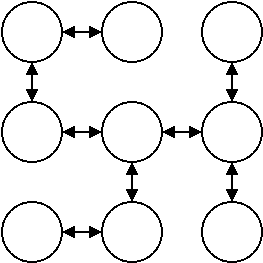

# Maze generation

Think of this simple graph on a grid:


If we take away a few edges, it becomes more interesting, reminiscent of a maze:



You could think of the process of making a maze as the transformation of one, densely connected graph into another, sparser graph. The input graph contains all *possible* paths you can take between cells. The output graph contains a random selection of edges, as few as possible, so that each node is *just* reachable. In the graph algorithm world, this is called a *minimum spanning tree*.

If you want to know more, I highly recommend [Mazes for programmers](http://www.mazesforprogrammers.com/)

Helixgraph currently contains one maze generation algorith, I plan to add more in the future. Here is how you may use it:

## Recursive Backtracker: generate a random maze

Here are some key bits of code to generate a 10x10 maze. For full source code, see [maze.js](../examples/maze/main.js)

```js
const linkCells = (src, dir, dest) => { src.link(dest, dir, reverse[dir]); };
const cellFactory = (x, y) => new Cell(x, y);

const grid = new BaseGrid(10, 10, cellFactory);

// generate maze
recursiveBackTracker(
	
	grid.randomCell(), // start seed
	
	// getAdjacent defines the input graph, it's exactly like a getNeighbor function
	n => grid.getAdjacent(n),  
	
	// linkCells is called for each edge that we choose to keep in the output graph
	// we can modify the existing grid structure, or copy to a new graph structure
	linkCells);

```